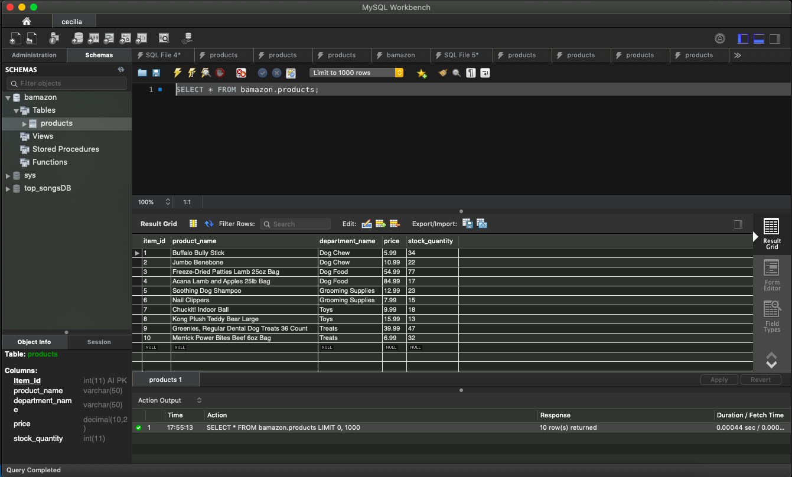

# bamazon <h1>

**This application uses MySQL to create an Amazon-like storefront.**

The shop's stocked items are updated and maintained using a table created in MySQL. Each product sold has a unique item id which allows the user to select the exact item they would like to purchase. Each product has a product name, department name, price, and stock quantity. 

When the user runs the application, they will be able to see the most up to date version of all the products, which will be displayed as a table. After the user has seen their shopping options, they will be prompted with two questions: What is the id of the item they would like to purchase? and How many would they like to buy? 

If the user picks an item that doesn't exist, they will be asked to pick another item id. If they pick an existing item id, but the store doesn't have enough in-stock to fulfill the order, the application will stop the user from moving forward and prompt them to select a new item id and quantity. 

After the user has entered an existing item id and quantity, the application will fulfill the order. Once the order has been fulfilled, the SQL database will be updated to reflect the new stocks. 

Lastly, the user will be notified the total cost of their purchase. Then, they will be prompted if they would like to make another purchase or end their shopping session. 

MySQL Preview 
 

Click on the link below for a demo: 
https://youtu.be/pljztROyUFw 
